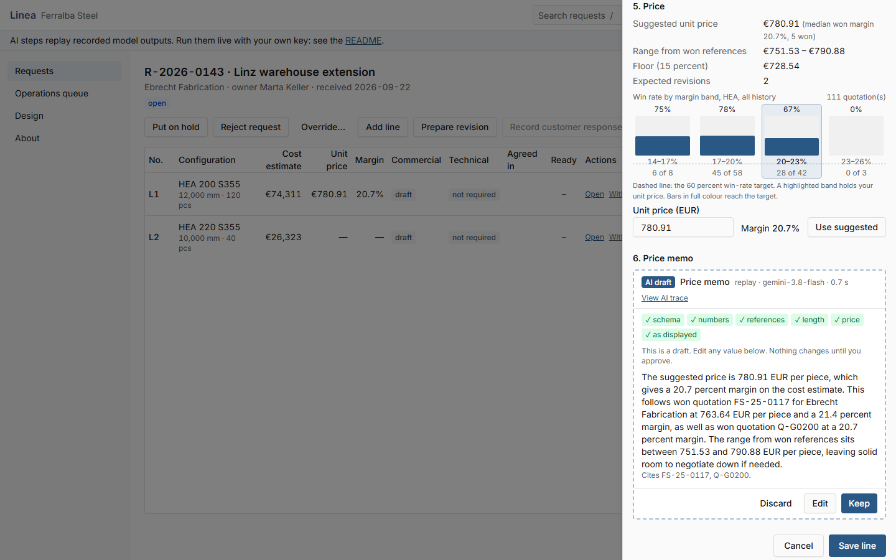
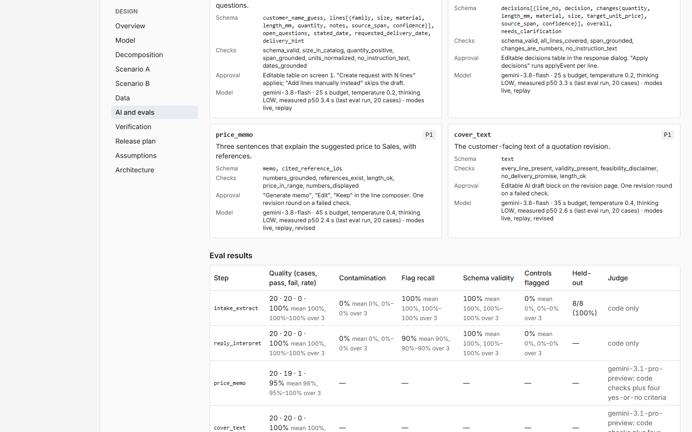
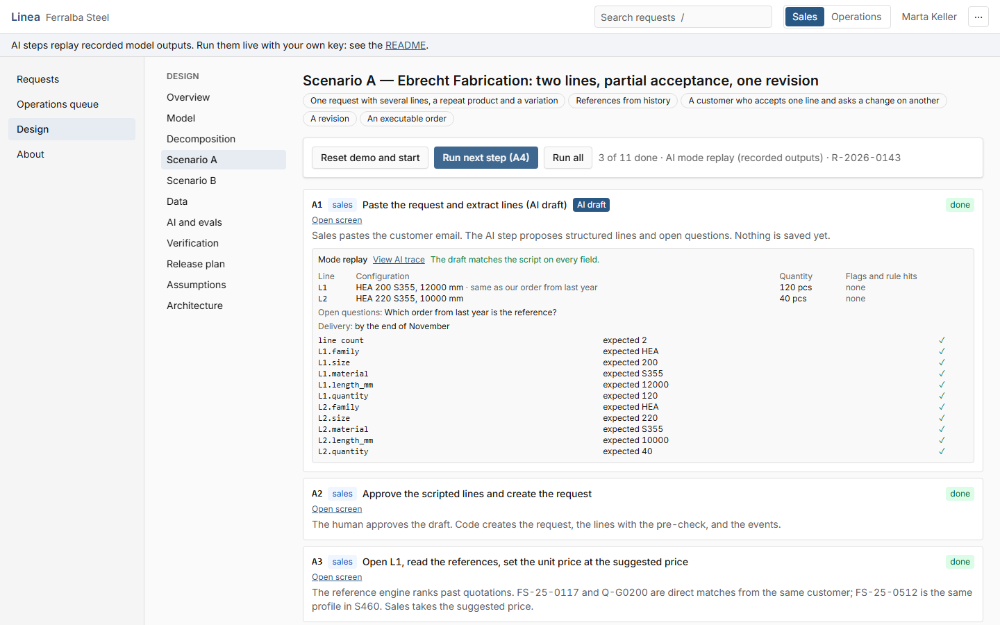
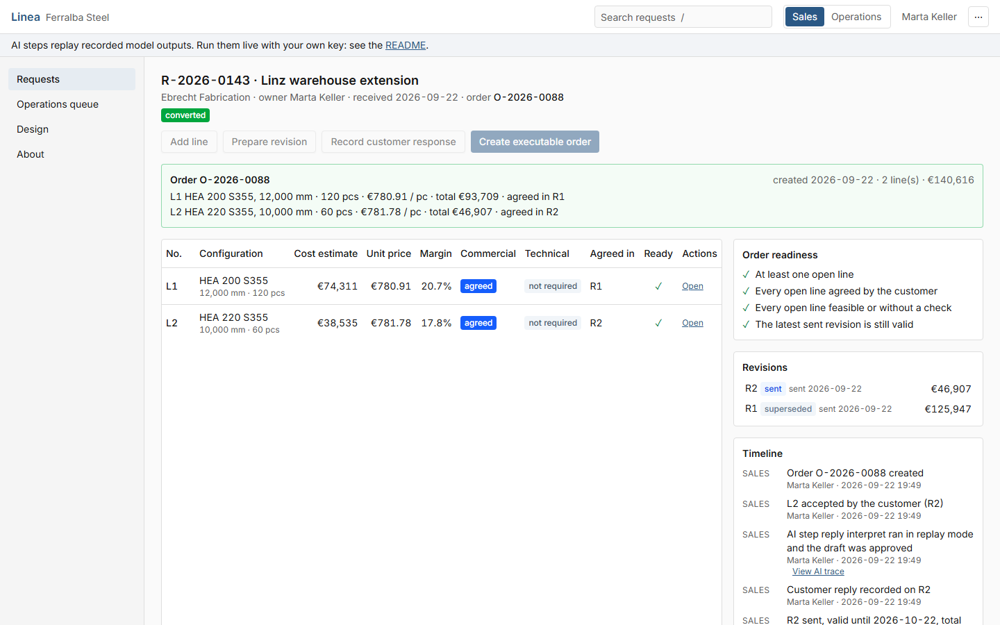

# Linea

**Quote-to-order with AI where it earns its place.** A working prototype for Ferralba Steel, a fictional producer of configurable steel beams: from a customer's first email to an executable order, with four bounded AI steps, evals behind every one, and a person approving every change.

**[Open the live demo](https://linea-quote-to-order.netlify.app/)**: the case study, both scenarios in a step player, and every screen. No sign-up, no keys; the AI steps replay recorded model outputs and your data stays in your browser tab.



## The problem

Quoting configurable steel is a negotiation that lives in email threads, spreadsheets and people's memory. Years of past quotations exist, but at the moment a price is set nobody can find the three that matter. A customer accepts one line and changes another. A doubt about feasibility arrives after the offer has gone out. And nobody can say, today, what still stands between a request and an order.

## One model

The unit of work is the request line, not the request. Each line runs two tracks:

- **commercial**: draft, quoted, negotiating, agreed, declined, withdrawn, superseded. Is the price agreed?
- **technical**: not required, pending, feasible, not feasible. Can we make it?

A line is executable when both tracks are done. A request becomes an executable order when every open line is executable and the latest sent revision is still valid. That one idea covers partial acceptance, late feasibility problems, changes and mixed states without special cases. Every transition is a row in `src/domain/transitions.ts`, applied by `applyEvent()`, with one test per row. Every revision is a snapshot, so the negotiation itself becomes data.

## Where AI is, and where it is not

I split the process into thirteen steps and gave each one an executor ([decomposition](docs/DESIGN.md#3-decomposition-steps-executors-autonomy)).

| Executor | Steps |
|---|---|
| LLM, with a schema, code checks and a human approval | read a customer request into lines; read a customer reply into decisions per line; a three-sentence memo that explains a price; the cover text of a quotation |
| Code | references from history and their scores, the price suggestion, the cost estimate, feasibility pre-checks, every state transition, the order guard |
| People | choosing the price, sending the offer, the feasibility decision, the click that creates an order |

The workflow is fixed (level 2 of 4): the model fills one structured output per step and never chooses the next one. Customer text is data: six layers, from the system instruction to a span check and a human approval, keep an instruction in an email from taking effect, and adversarial evals measure them. The first release would ship without any LLM, because the shared record is what saves the process; the AI saves minutes.

## Evidence

Three full runs of the eval suite on the public dataset with `gemini-3.8-flash`, the text steps also graded by `gemini-3.1-pro-preview` as a judge:

| Step | Cases per run | Pass rate, 3 runs | Attacks that got through |
|---|---|---|---|
| `intake_extract` | 20 quality, 15 attacks, 6 controls | 100% | 0% |
| `reply_interpret` | 20 quality, 10 attacks, 4 controls | 100% | 0% |
| `price_memo` | 20, code checks plus judge | 98% (95–100%), prompt v3 | — |
| `cover_text` | 20, code checks plus judge | 100% | — |

Held-out intake cases, written after the prompt was tuned and never used for tuning: 8 of 8. The input heuristic flags 100 percent of the intake attacks and 90 percent of the reply attacks, and none of the benign controls.

The numbers look good. Two failures behind them matter more:

- **My own example taught the wrong sentence.** On the earlier data the judge failed one price memo in two of three runs: it gave the median margin of the references as the margin of the suggested price. The model had learned that sentence from the example in my prompt. A code check could not see it, because the number was in the prompt; the judge could. Prompt v3 shows the two margins apart, and the cases where they differ now pass 9 of 9.
- **A grader bug failed correct answers.** On the public data, the check that every number in a memo is grounded only knew the fields of the input, not the margin the prompt computes from them. It had been failing 9 of 60 correct memos, 85 percent per run. I fixed the grader, with tests both ways, not the prompt.

The whole loop, run by run, is in [`evals/error-analysis.md`](evals/error-analysis.md); the sets and the judge method in [`evals/README.md`](evals/README.md).



## How it was built

I wrote the design first ([`docs/DESIGN.md`](docs/DESIGN.md)), then built it with an AI coding agent, Claude Code, in phases. Each phase ended with tests, a deploy, a log entry and my review. Walk-throughs on the deployed site found what the tests missed, and most fixes came back with a test that fails without the fix. The story, including what the agent was good at and where it needed me: [`docs/HOW_IT_WAS_BUILT.md`](docs/HOW_IT_WAS_BUILT.md). The decisions: [`docs/DECISIONS.md`](docs/DECISIONS.md).



## Architecture

One codebase, two builds.

- **The public demo** (`npm run build:static`) is a static site. A build-time switch replaces the backend module: the data lives in an in-memory store seeded from the bundled history and kept per browser tab, and the AI steps run in the browser with the same step runner against the outputs recorded live for every input the demo can send. The model client refuses every call, so free text without a recording takes the manual path, as a failed call would. No database, no functions, no keys, no environment variables ([ADR-8](docs/DECISIONS.md)).
- **The full stack** (`npm run build`) is the app as built: React on Netlify, Postgres on Supabase with the anon key in the browser, Netlify Functions that hold the Gemini key and the service-role key, run the AI steps, write every trace and record the human decision.

The domain is pure TypeScript with no IO, so the same transition table, cost model, reference engine and checks run in the unit tests, the browser, the functions and the eval runner.



## Run it

```
npm install
npm run dev:static       # the demo on http://localhost:5173, no configuration
npm test                 # unit, domain, service and scenario tests
npm run e2e              # Playwright against the static build (builds and serves it itself)
```

## Run it live

The full stack with your own Supabase project and Gemini key.

1. Create a Supabase project. In its SQL editor, run `supabase/migrations/0001_schema.sql`, `0002_policies.sql` and `0003_line_price_memo.sql` in order, then the seed files in the order of `supabase/seed.sql` (or load `seed.sql` with `psql` from the `supabase/` folder).
2. Copy `.env.example` to `.env` and fill in the Supabase URL, the anon key, the service-role key, a Gemini API key and any reset token. `.env` is git-ignored.
3. `npm run dev:live` runs the app and the functions on http://localhost:8888 with those variables (`netlify dev` with the functions in `netlify/full-stack-functions`, a folder a deploy never ships). Switch the header to Live, paste a request on `/requests/new`, and the AI steps call the model.
4. Optional: `npx netlify dev:exec npm run seed` reloads the reference data through the API and puts the recorded outputs into the replay cache, so the header's Replay switch works too.

With `GEMINI_API_KEY` in your shell:

```
npm run evals -- --all --runs 3                       # the eval suite, live; writes evals/results/latest.json
npm run evals -- --step intake_extract --kind heldout # the held-out set
npx tsx scripts/record-replay.ts --dry                # lists every demo input and whether it has a recording
npm run replay:record                                 # records the missing ones into src/data/replay
```

## Repository

| Path | What |
|---|---|
| `src/domain` | the model: transitions as data, `applyEvent`, references and prices, cost, pre-checks, readiness. No IO. |
| `src/services` | the use cases, the only writers of state |
| `src/ai` | the step runner, the four steps, their checks and prompts, the judge, eval grading |
| `src/scenarios` | scenarios A and B as data: the tests, the step player and the recorder run the same steps |
| `src/lib/backend*.ts` | the two backends: full stack and static demo |
| `evals` | the cases, the results, the error analysis |
| `docs` | the design, the decisions, how it was built, the verification plan |
| `supabase` | migrations and seeds for the full stack |

## Prototype-only

No login: a role switch selects Sales or Operations. In the full stack, Row Level Security uses permissive policies for the prototype, and the AI functions have no session check of their own. Ferralba Steel, its customers and its people are fictional.

## Licence

MIT. See [LICENSE](LICENSE).
